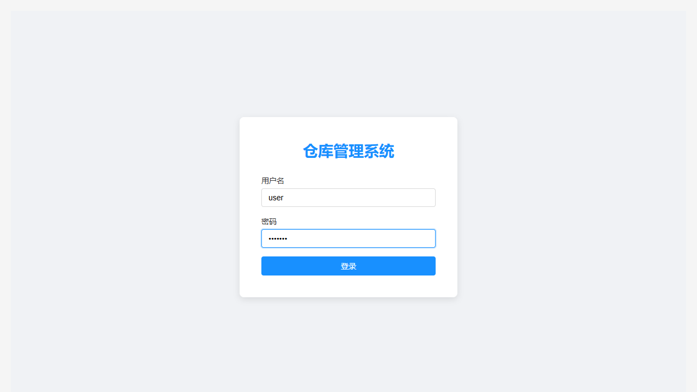
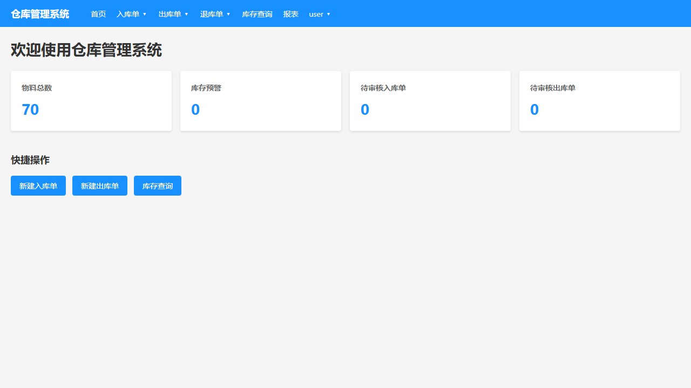
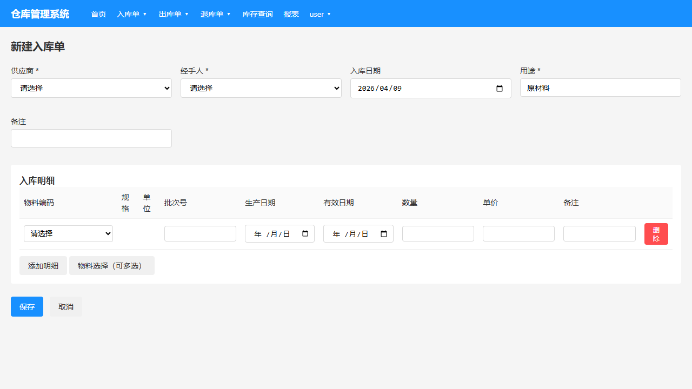
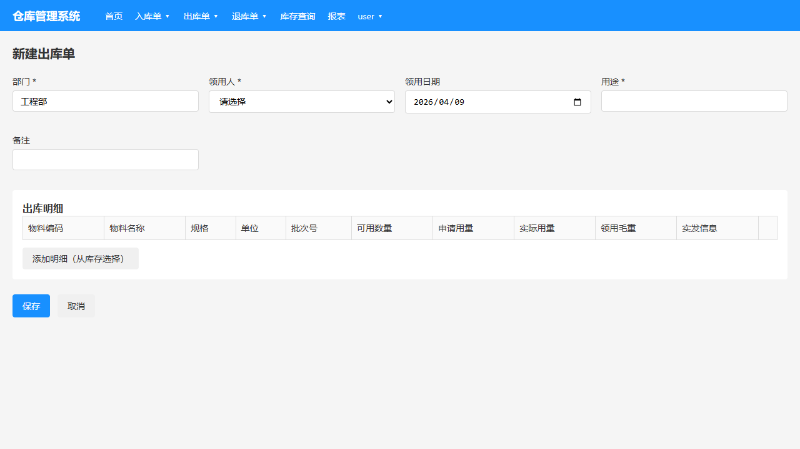
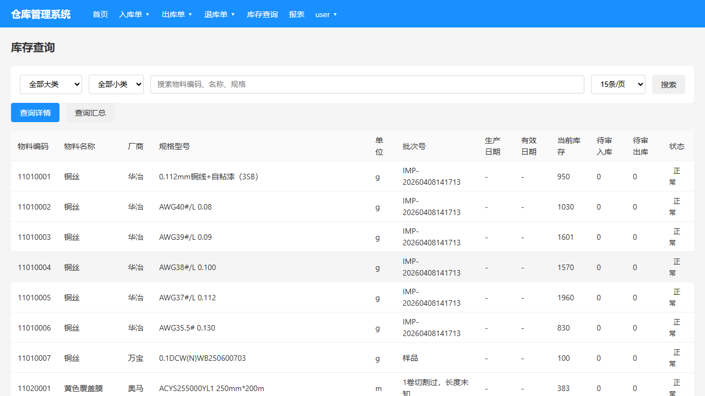
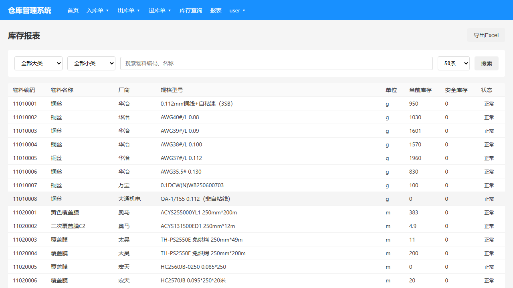
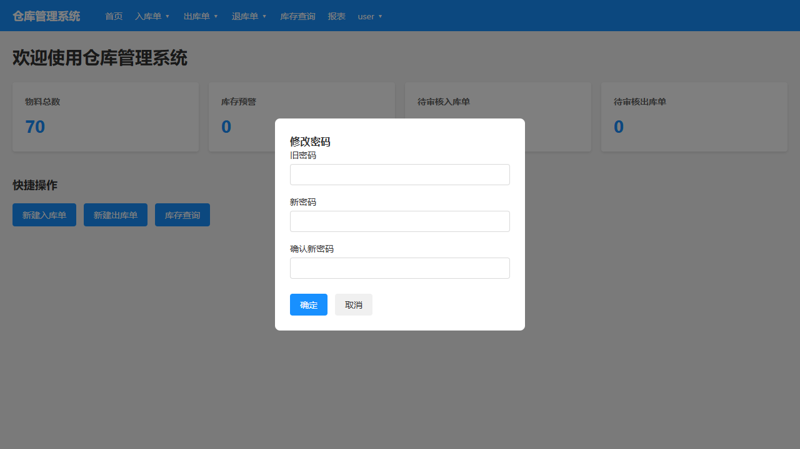

# 仓库管理系统 - 普通用户操作说明

## 目录

1. [登录与退出](#1-登录与退出)
2. [首页概览](#2-首页概览)
3. [新建入库单](#3-新建入库单)
4. [新建出库单](#4-新建出库单)
5. [库存查询](#5-库存查询)
6. [查看报表](#6-查看报表)
7. [修改密码](#7-修改密码)

---

## 1. 登录与退出

### 登录

1. 打开系统地址 http://192.168.2.14:5000/，进入登录页面
2. 输入用户名 `user` 和密码 `user123`
3. 点击「登录」按钮

### 退出

1. 点击右上角用户名
2. 选择「退出」

---

## 2. 首页概览

登录后进入首页，显示：

- **快捷操作** - 快速创建单据
- **物料总数** - 当前物料种类数量
- **库存预警** - 低于安全库存的物料数量
- **待审核单据** - 待审核的入库单、出库单数量

### 快捷操作按钮

- 新建入库单
- 新建出库单
- 库存查询

### 菜单说明

普通用户可以看到以下菜单：
- 首页
- 入库单（新建入库单、入库单管理、入库台账）
- 出库单（新建出库单、出库单管理、出库台账）
- 退库单（新建退库单、退库单管理、退库台账、称重记录）
- 库存查询
- 报表

**注意**：基本资料菜单（物料管理、供应商管理等）只有管理员可见。

---

## 3. 新建入库单

### 操作步骤

1. 点击「新建入库单」
2. 填写入库单信息：
   - **供应商** - 选择供应商（必填）
   - **经手人** - 选择员工（必填）
   - **入库日期** - 选择日期
   - **用途** - 输入用途（必填）
3. 添加物料明细：
   - 点击「添加明细」
   - 选择物料
   - 填写批次号、生产日期、有效日期、数量、单价
4. 点击「保存」

### 注意事项

- 至少需要添加一条明细
- 物料编码可通过搜索选择
- 保存后需由管理员审核

---

## 4. 新建出库单

### 操作步骤

1. 点击「新建出库单」
2. 填写出库单信息：
   - **部门** - 输入部门名称
   - **领用人** - 选择员工
   - **领用日期** - 选择日期
   - **用途** - 输入用途
3. 添加物料明细：
   - 点击「添加明细（从库存选择）」
   - 选择物料和批次
   - 填写实际用量
4. 点击「保存」

### 注意事项

- 只能选择有库存的物料和批次
- 保存后需由管理员审核
- 审核后库存会自动扣减

---

## 5. 库存查询

### 查询详情

1. 点击「库存查询」
2. 默认显示「查询详情」，按批次显示库存

### 查询汇总

1. 点击「查询汇总」
2. 按物料汇总，不显示批次

### 筛选功能

- **按大类/小类筛选** - 选择分类快速定位
- **关键字搜索** - 输入物料编码或名称搜索

---

## 6. 查看报表

### 库存报表

1. 点击「报表」→「库存报表」
2. 可按分类筛选
3. 支持导出 Excel

### 字段说明

| 字段 | 说明 |
|------|------|
| 物料编码 | 物料唯一标识 |
| 物料名称 | 物料名称 |
| 厂商 | 物料供应商/厂商 |
| 规格型号 | 物料规格 |
| 当前库存 | 现有库存数量 |
| 安全库存 | 低于此数量会显示警告 |
| 状态 | 正常 / 低于安全库存 |

---

## 7. 修改密码

### 操作步骤

1. 点击右上角用户名
2. 选择「修改密码」
3. 输入旧密码和新密码
4. 点击「确定」

### 注意事项

- 新密码建议包含字母和数字
- 修改后需重新登录

---

## 常见问题

### Q: 为什么我创建的入库单没有审核按钮？

A: 审核需要管理员权限，普通用户创建的单据由管理员审核。

### Q: 库存数量不对怎么办？

A: 联系管理员核查是否有未审核的单据。

### Q: 能修改已审核的单据吗？

A: 不能，需先由管理员作废或红冲。

---

*最后更新：2026年4月*
